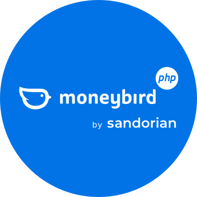

<p align="center">
  
</p>

# Moneybird API client for PHP

[](https://packagist.org/packages/sandorian/moneybird-api-php)
[](https://github.com/sandorian/moneybird-api-php/actions/workflows/run-tests.yml)
[](https://packagist.org/packages/sandorian/moneybird-api-php)

Effortlessly interact with the Moneybird API using your favourite language PHP.

This package leverages the popular and robust [Saloon PHP](https://docs.saloon.dev) package.

## Official Documentation

Documentation for this package can be found on the [documentation website](https://moneybird.sandorian.com/).

## Testing

```bash
composer test
```

## Changelog

Check the releases for more information on what has changed recently.

## Security Vulnerabilities

If you discover any security related issues, please email security@sandorian.com instead of using the issue tracker.

## Credits

- [Sandorian.com](https://www.sandorian.com)
- [Moneybird.com](https://www.moneybird.com)
- [Saloon PHP](https://docs.saloon.dev)
- [All Contributors](../../contributors)

## License

The MIT License (MIT). Please see [License File](LICENSE.md) for more information.
